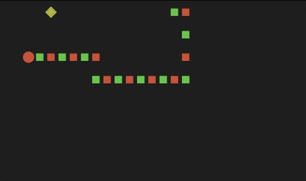
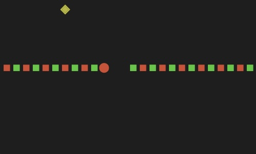

# Snake
Bash implementation of popular game

## Screenshots




## Run
To run just download snake.sh, adjust your terminall window and font size and simply
```
bash snake.sh
```
than move with 'w', 's', 'd', 'a' and try to not eat yourself.

Delays in game are comfortable for me, playing it on raspberry pi, if you'd prefer another you can simply change it in code, at line 186.
